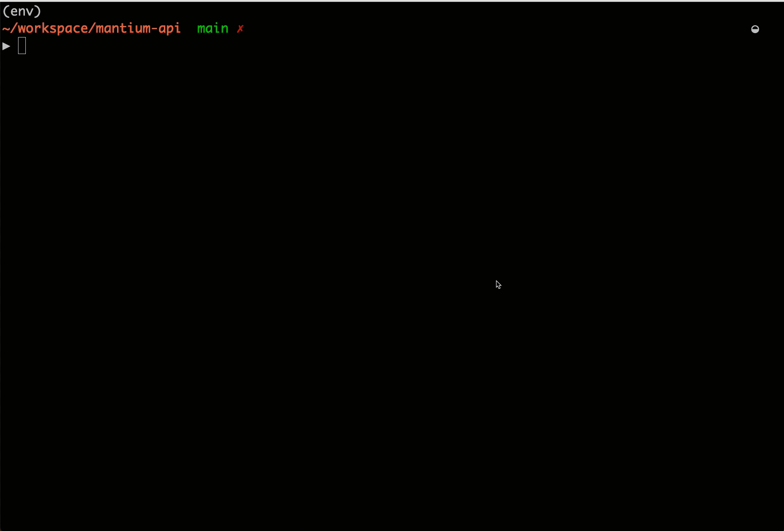
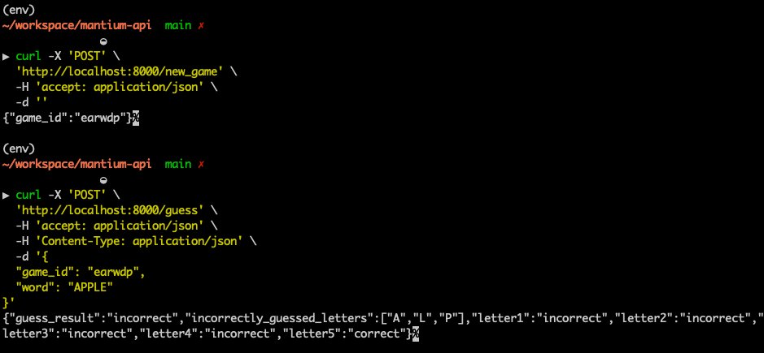
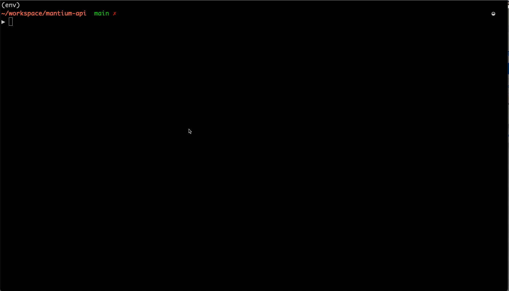

# Have fun with Wordle !
## Quick Demo of this App


# How do I run the game locally ?
First, make a `.env` file !!!  
it could be empty if you don't need override any environmental variables

and then, simply run in your terminal at this directory
```
docker-compose up
```
once you see everything is up in terminal, you can visit below link to play the game
```
http://localhost:3000
```
Local start verified on
```
Docker Compose version v2.12.2
Docker version 20.10.21
```

# Developer Notes
## Contribution Quick Start
First, make a `.env` file !!!  
it could be empty if you don't need override any environmental variables


you can run `docker-compose up` to start services for sure,
but there is a easier way, this project automated serveral everyday use commands into [pyinvoke](https://www.pyinvoke.org/) scripts  
For example, to start the project, you can simply type
```
inv local.start
```



After it's started, you can verify basic APIs using curl
make a new game
```
curl -X 'POST' \
  'http://localhost:8000/new_game' \
  -H 'accept: application/json' \
  -d ''
```
make a guess
```
curl -X 'POST' \
  'http://localhost:8000/guess' \
  -H 'accept: application/json' \
  -H 'Content-Type: application/json' \
  -d '{
  "game_id": "earwdp",
  "word": "APPLE"
}'
```
expected outputs



to clean up all containers, mounted volumes, images after use
```
inv local.cleanup
```

for more, type 
```
inv local.help
```




## hot reloads
✅ React dev env hot reload  
✅ Fastapi dev server hot reload


## Folder Structure
```
├── Makefile                      
├── constraints.txt
├── docker
│   ├── DockerfileLocal
│   ├── DockerfileLocalUI
│   └── mongo                     - local mongo admin user creation
├── docker-compose.yml            - all container services for local
├── pyinvoke_tasks                
│   └── local.py                  - makefile in python, heavily used
├── pyproject.toml                - black,isort,ruff configs
├── requirements-dev.txt 
├── requirements-local.txt        - minimum requirement for local
├── requirements.txt
├── tasks.py
├── ui
│   └── src
|       ....
├── wordle                        - the backend
│   ├── __init__.py
│   ├── api_schemas
│   ├── apis
│   ├── config.py
│   ├── db.py
│   ├── exceptions.py
│   ├── models
│   ├── server.py
│   ├── services
│   ├── tests
│   └── utils.py
└── words.txt                     - downloaded words
```